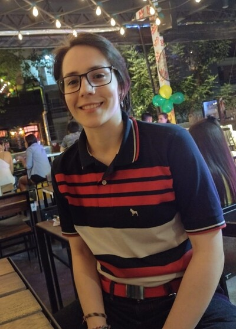
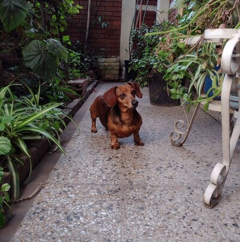
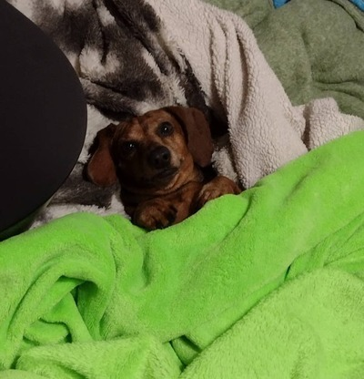

# Cecilia Lucia Dimotta
Tengo CASI 22 años y mi legajo es **203.568-6**

## Información académica 
Me egresé de bachiller en comunicación *NADA QUE VER JAJA* acá en el más grande: **Lanús >>:)**

A la hora de decidirme por cuál carrera cursar estuve entre odontología 🦷 o esta bella carrera, pero pinchó odontología porque no me gusta la química y esa carrera tiene bastante. 
A veces me pregunto cómo sería mi vida si hubiera elegido cursar esa otra carrera, pero solo como caso hipotético, porque estoy segura que puedo decir que no me arrepiento de haber elegido Sistemas :) "What if...?"

Estoy cursando materias de 2do año y próximamente una que otra de otro año. 

Sobre la programación, es el día de hoy que no sé qué tan bien se me da :') solo sé C++ por AyED, pero mentiría si no dijera que me gustaría aprender otros lenguajes como Phyton, *algún día me gustaría testear qué tan bien me llevo con el desarrollo front-end.* 
Probablemente si me recibo sería una ingeniera que trabaje alejada de la programación, **pero ojo**, no descarto nada de lo que me depare el futuro.

Tengo muchas ganas de mejorar mi nivel de inglés y para ello encontré que mi motivación más grande para hacerlo es por si algún día tengo que darle indicaciones a Billie Eilish sobre dónde queda el obelisco. 

## Datos de color sobre mi: 
Ya empiezo esta sección de forma polémica: Adoro el helado de menta granizada. No me importa nada, es: **patria, familia y menta granizada**

Banco mucho tomar mate 🧉 *usualmente empiezo tomarlo un poco dulce hasta que se va suavizando y después lo tomo normal, sin aditivos añadidos (?*

Escucho música de TODO tipo, pero mi banda favorita es Tan Biónica desde que era adolescente, ***fua tenía 200 años la Edward Cullen***, no solo porque me gustan las letras y ritmos, sino 
porque tambien marcó muchas vivencias y personas a lo largo de mi vida.

Me gusta mucho hacer música (gusto heredado de mi progenitor) gracias a él toqué varios instrumentos a lo largo de mi vida (? pero ahora solo me estoy concentrando en la guitarra 🎸. 
Algún día me gustaría aprender a tocar la batería, pero todavía no conseguí que mi señora madre me deje meter una a la casa...

Me divierte jugar lolcito (*main jg y botline*) y TFT (*aunque soy de madera para ambos*), y uno que otro shooter (*no soy de madera, soy de carbón ahí* ***juas juas***) 🖥🖱

Me encantan los olores, si pudiera tendría mi casa llena de perfumes pero, **humildad ante todo**, así que por ahora solo tengo algunos (*el incienso me da alergia y es uno de los pocos olores que no me gustan*)

Tengo problemas para combinar los colores y prendas de vestir, nunca se me dio bien, asi que para eso me amigué con Pinterest y ahora somos como familia. No me des a elegir una gama de colores tan amplia para lo que sea porque me agarra un patatús.

Es el día de hoy en que todavía no me decido si soy team dulce o salado, ambos lados tienen su maravilla. *No todo en la vida es blanco y negro dicen por ahí, creo...*

Se me sale el alma del cuerpo cuando alguien me regala una pulserita (***las amo***) me parecen un detalle precioso y tan simple que soy fan. La pulsera más longeva que tengo puesta tiene 7 años 🤶.

## Perra salchicha gorda bachicha

Tengo una hermosa perra salchicha gorda bachicha de sobrina **uwu**

Su nombre es Jazmín, pero yo la llamo Chancho 🐷 porque hace tremendos ruiditos de chancho. Acá en casa tiene mil nombres: Jaz, Mimin, Toti, Charly, Mona, etc, etc, etc. ***Básicamente el que se te ocurra en el momento, a ella le viene bien todo.***

Le encanta la cama y odia quedarse solita en casa unu

